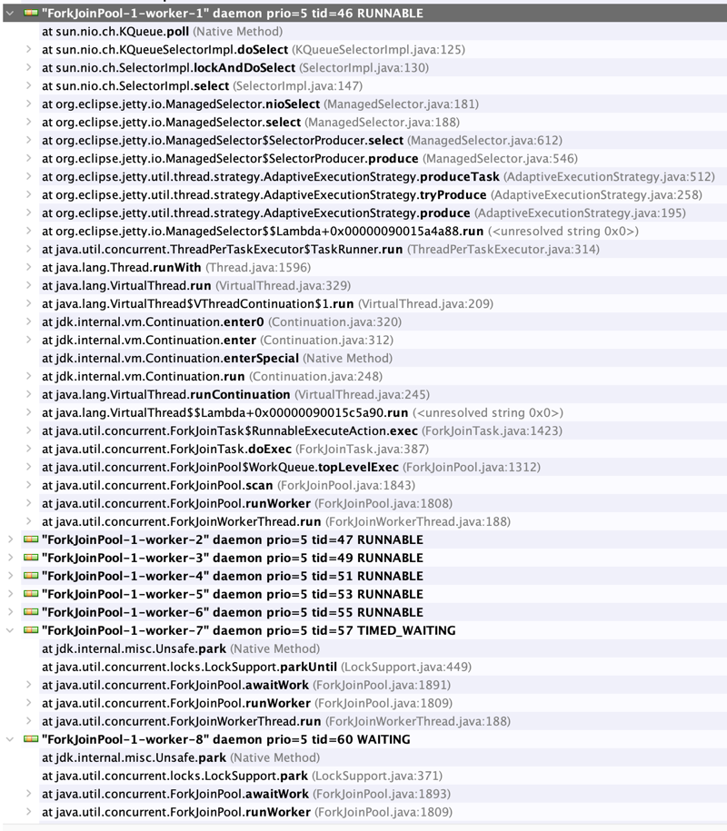

# Demo to show freezing a Spring Boot application with Jetty Http client and Virtual Threads

By calling a `RestClient` just once, so that it initializes the `executor`, the application becomes completely
unresponsive after about 60s. After about 30s the first `ForkJoinPool` worker stops after its idle timeout, and about
30s later the second one stops too.

Note: neither of the stopped `ForkJoinPools` are "hijacked" by Jetty it seems, the other 6 are (see first screenshot).

The application was started with `-Djdk.virtualThreadScheduler.parallelism=2`: 2 "normal" `ForkJoinPools`, 6 "hijacked"
pools.

To test different behaviours:

1. Start with profile `init-clients` to see the application freezing after 60s
2. Start without profile `init-clients` to see the application working fine

Heap dump with Virtual Thread Executor:

Heap dump with Virtual Thread Executor, but without calling the `RestClient`:

